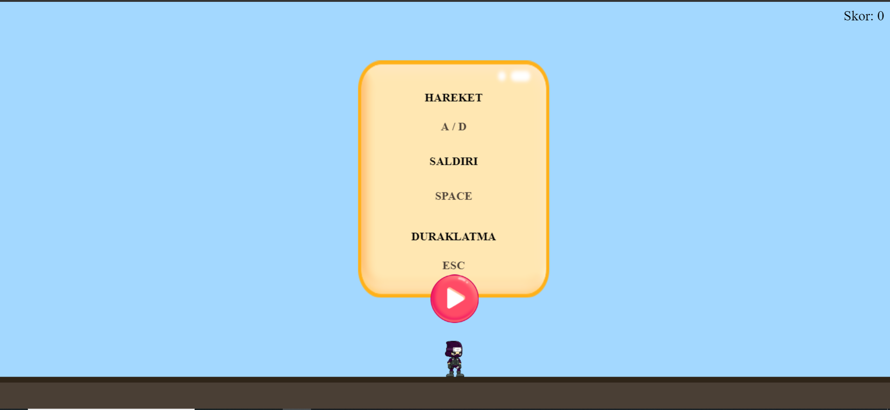
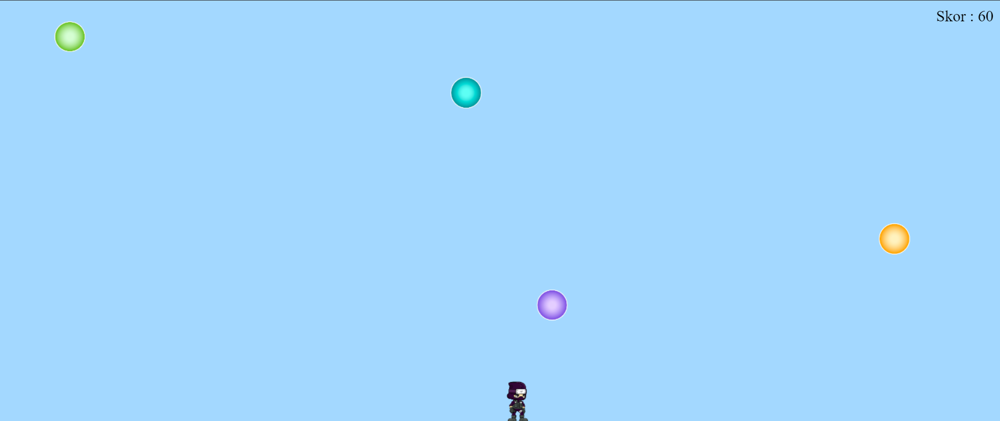

# JS_GAME_Balon_Avcisi
 
Bu proje, HTML ve JavaScript kullanılarak geliştirilmiş olan "Balon Avcısı" adlı bir oyundur. Oyuncular, bir platform üzerindeki bir ninjayı kontrol ederler ve üzerlerine düşen balonları patlatmaya çalışırlar. Balonları patlatarak puan toplarlar ve amacı en yüksek puanı elde etmektir.

# Kullanılan Teknolojiler 
* HTML
* JAVASCRİPT
  
# Proje Görselleri

# Proje Linki
[Balon Avcısı](https://js-game-balon-avcisi.vercel.app)

# Oynanış Videosu
[Youtube](https://youtu.be/tr_OEJFBBxk)

# Projeyi Geliştirenler
- Lütfü Bedel

